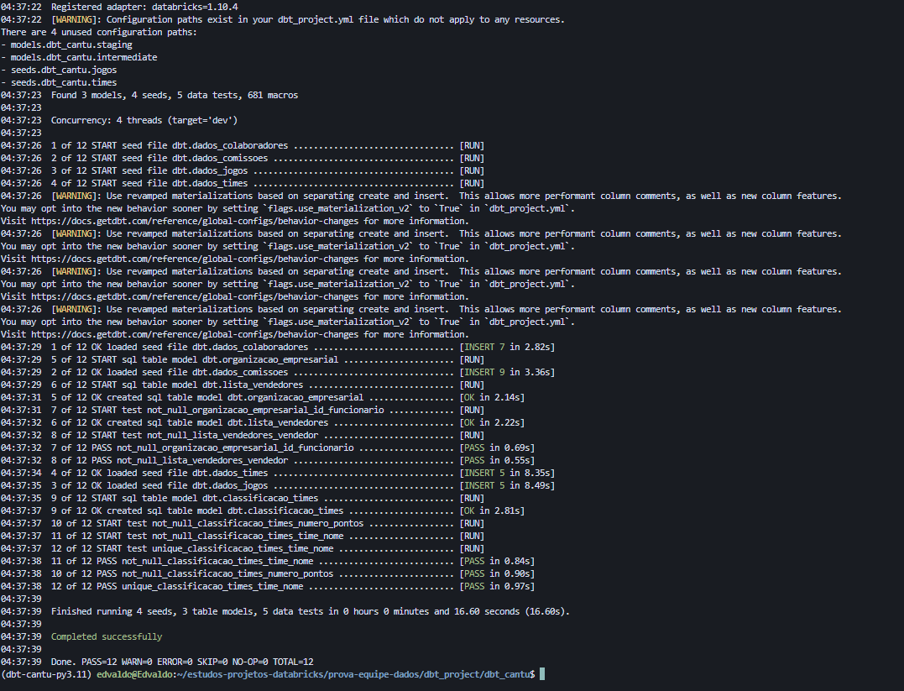
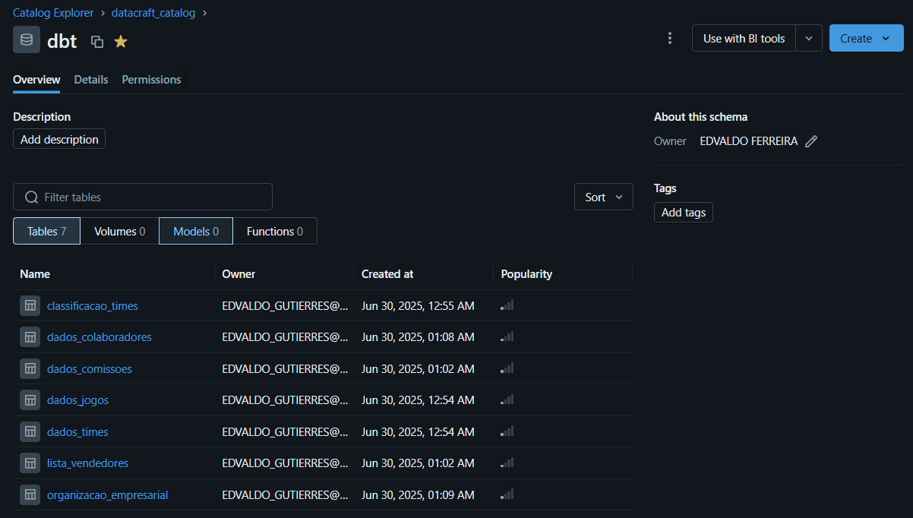

# 🏪 DBT CantuStore - Projeto de Transformação de Dados

## 📋 Visão Geral

Este projeto DBT faz parte da prova de proficiência para **Engenheiro de Dados** da **CantuStore**. Implementa transformações de dados para análises de campeonato, comissões de vendas e estrutura organizacional usando **Databricks** como plataforma.

## 🏢 Sobre a CantuStore

A **CantuStore** é uma plataforma de tecnologia e logística que viabiliza soluções completas em pneus, guiando quem compra e apoiando quem vende. Produtos e serviços em uma experiência 360° para abrir caminhos e ver pessoas e negócios evoluindo.

## 🎯 Objetivos do Projeto

### Análises Implementadas:
1. **📊 Classificação de Times** - Cálculo de pontuação de campeonato
2. **💰 Lista de Vendedores** - Identificação de vendedores qualificados por comissão
3. **🏗️ Organização Empresarial** - Mapeamento de hierarquia corporativa

## 🛠️ Tecnologias Utilizadas

- **DBT Core** `1.10.2` - Framework de transformação
- **Databricks** - Plataforma de dados
- **Unity Catalog** - Governança de dados
- **Delta Lake** - Armazenamento otimizado

## 📁 Estrutura do Projeto

```
cantu/
├── models/
│   ├── source.yml                    # Definição das sources
│   ├── staging/                      # Modelos de limpeza
│   │   ├── dados_times.sql
│   │   ├── dados_jogos.sql
│   │   ├── dados_colaboradores.sql
│   │   └── dados_comissoes.sql
│   └── marts/                        # Modelos finais
│       ├── campeonato/
│       │   ├── classificacao_times.sql
│       │   └── config.yml
│       ├── comissao/
│       │   ├── lista_vendedores.sql
│       │   └── config.yml
│       └── organizacional/
│           ├── organizacao_empresarial.sql
│           └── config.yml
├── seeds/                            # Dados estáticos
├── tests/                            # Testes customizados
└── README.md                         # Este arquivo
```

## 🚀 Como Executar

### Pré-requisitos
- Python 3.11+
- DBT Core instalado
- Acesso ao Databricks configurado
- Variável de ambiente `DATABRICKS_TOKEN` definida

### Comandos Principais

```bash
# Instalação de dependências
dbt deps

# Execução completa (recomendado)
dbt build

# Apenas modelos
dbt run

# Apenas testes
dbt test

# Comandos específicos
dbt run --select classificacao_times
dbt test --select organizacao_empresarial
```

## 📊 Modelos Disponíveis

### 🏆 Campeonato (`marts.campeonato`)

**`classificacao_times`**
- **Descrição**: Calcula pontuação de times baseada em jogos
- **Colunas**: `time_nome`, `numero_pontos`
- **Regras**: Vitória=3pts, Empate=1pt, Derrota=0pts

### 💼 Comissões (`marts.comissao`)

**`lista_vendedores`**
- **Descrição**: Vendedores com ≥R$1.024 em até 3 transferências
- **Colunas**: `vendedor`
- **Filtro**: Max 3 comissões, soma ≥ 1024

### 🏢 Organizacional (`marts.organizacional`)

**`organizacao_empresarial`**
- **Descrição**: Mapeia chefes indiretos com critério salarial
- **Colunas**: `id_funcionario`, `id_chefe_indireto`
- **Regra**: Chefe indireto ganha ≥ 2x salário do funcionário

## 🧪 Testes de Qualidade

### Testes Implementados:
- ✅ **Unicidade**: IDs únicos
- ✅ **Não-nulos**: Campos obrigatórios
- ✅ **Referências**: Integridade entre tabelas
- ✅ **Valores válidos**: Domínios específicos

### Executar Testes:
```bash
# Todos os testes
dbt test

# Por modelo
dbt test --select classificacao_times

# Por tipo
dbt test --select test_type:unique
```

## 🎛️ Configuração

### Sources
- **Database**: `datacraft_catalog`
- **Schema**: `cantu`
- **Tabelas**: `times`, `jogos`, `colaboradores`, `comissoes`

### Materialização
- **Staging**: `view` (rápido, para limpeza)
- **Marts**: `table` (performance, para análise)

## 📈 Monitoramento

### Métricas de Execução:
```bash
# Logs detalhados
dbt run --log-level debug

# Apenas compilação (sem execução)
dbt compile

# Documentação
dbt docs generate
dbt docs serve
```

## 🔧 Solução de Problemas

### Erros Comuns:

**Erro de Catálogo:**
```bash
# Verificar configuração
dbt debug

# Validar sources
dbt source freshness
```

**Erro de Coluna:**
```bash
# Verificar estrutura
dbt show --select nome_do_modelo

# Compilar sem executar
dbt compile --select nome_do_modelo
```

## 📚 Recursos Adicionais

- 📖 [DBT Documentation](https://docs.getdbt.com/)
- 🏗️ [Databricks DBT Guide](https://docs.databricks.com/integrations/dbt.html)
- 💬 [DBT Community](https://community.getdbt.com/)
- 📧 **Suporte**: Entre em contato para dúvidas específicas do projeto

## 🏷️ Versão

- **Projeto**: `1.0.0`
- **DBT**: `1.10.2`
- **Databricks Adapter**: `1.10.4`

---


## Objetos criados:





---

*Desenvolvido para a prova técnica de Engenheiro de Dados - CantuStore 2024*